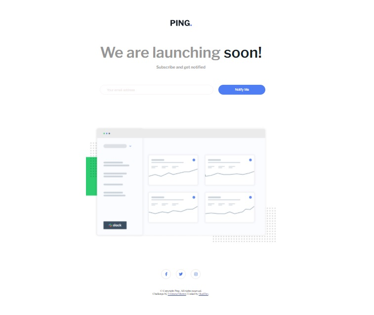

# Frontend Mentor - Ping coming soon page solution

This is a solution to the [Ping coming soon page challenge on Frontend Mentor](https://www.frontendmentor.io/challenges/ping-single-column-coming-soon-page-5cadd051fec04111f7b848da). Frontend Mentor challenges help you improve your coding skills by building realistic projects. 

## Table of contents

- [Overview](#overview)
  - [The challenge](#the-challenge)
  - [Screenshot](#screenshot)
  - [Links](#links)
- [My process](#my-process)
  - [Built with](#built-with)
  - [What I learned](#what-i-learned)
  - [Continued development](#continued-development)  
- [Author](#author)

## Overview

  With this challenge I´ve applied knowledge about CSS, HTML, Flexbox and Java Script Vanilla.

### The challenge

Users should be able to:

- View the optimal layout for the component depending on their device's screen size
- See the social media share links when they click the share icon
- Show a message error if the email entered is incorrect

### Screenshot

### Links

- Solution URL: 
- Live Site URL: 

## My process

  I´ve designed with CSS and HTML, I used flexbox too. I´ve applied Java Script Vanilla

### Built with

- Semantic HTML5 markup
- CSS custom properties
- Flexbox
- Mobile-first workflow
- Java Script Vanilla

### What I learned

I learned to use the Flexbox model.

### Continued development

I´d like to learn about grid an Java Script.

## Author

- Website - [Hualdo](https://hualdop.github.io/Hualcap/)
- Frontend Mentor - [@Hualdop](https://www.frontendmentor.io/profile/Hualdop)
- Twitter - [@Hualdos](https://www.twitter.com/hualdos)
